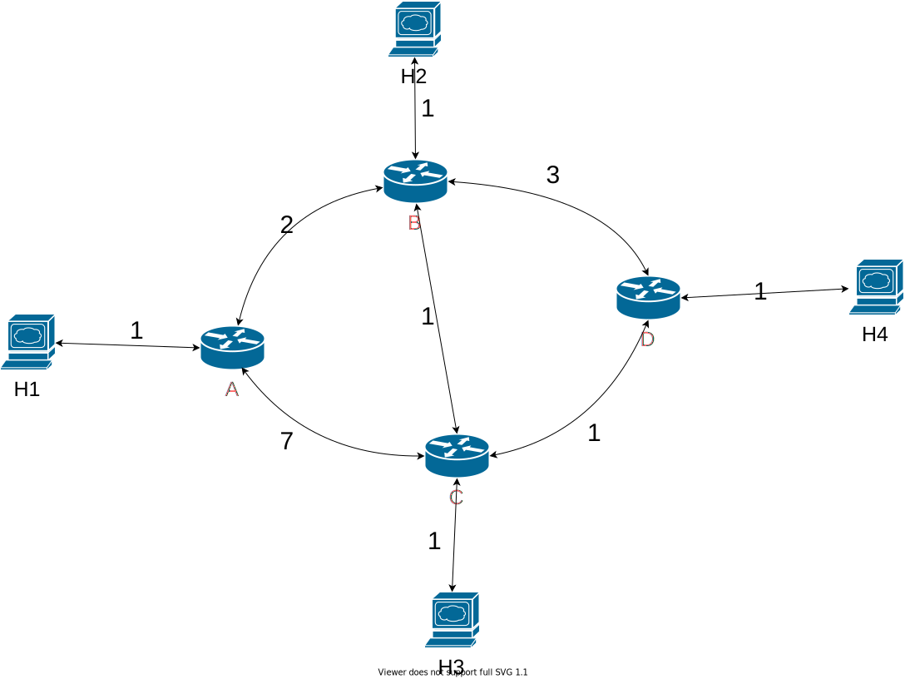

# RIP Router Protocol Report

---

## 实验目的

通过软件实现RIP协议，详细分析距离矢量路由算法，掌握网络协议的构建过程

## 实验内容

在软件层面构建网络拓扑，编写路由器等代码，然后基于网络拓扑实现RIP路由协议，以及相应分析实验结果，如何实现路由表的动态更新等

## 实验原理

* 路由信息协议（Routing Information Protocol）
  * 简介
  
  > 是一种内部网关协议，为最早出现的距离向量路由协议。属于网络层，其主要应用于规模较小的，可靠性较低的网络，可以通过不断的交换信息让路由器动态的适应网络连接的变化，这些信息包括每个路由器可以到达哪些网络，这些网络有多远等   ——维基百科

  * 运作原理

  > 每隔30秒 会于相邻的路由器交换子信息，以动态的创建路由表

  * RIP数据包格式

  <table>
    <tr>
      <td width=5% align="center">command(1)</td>
      <td width=5% align="center">version(1)</td>
      <td width=20% align="center">must be zero(2)</td>
    </tr>
    <tr>
      <td width=10% colspan=2 align="center">address family identifier (2)</td>
      <td align="center">must be zero (2)</td>
    </tr>
    <tr>
      <td colspan=4 align="center">IP address (4)</td>
    </tr>
      <td colspan=4 align="center">must be zero (4)</td>
    <tr>
      <td colspan=4 align="center">must be zero (4)</td>
    </tr>
    <tr>
      <td colspan=4 align="center">metric (4)</td>
    </tr>
</table>

  > 内部（1）表示的为字节计数，命令Command字段为1时表示RIP请求，为2时表示RIP应答。地址类型标志符在实际应用中总是为2，即地址类型为IP地址。“IP”地址字段表明目的网络地址，“Metric”字段表明到达目的网络所需要的跳数，距离度量值用跳数来衡量，取值范围为1-16，其中16表示无限远（不可达）。路由器每经过30秒发送一次Response报文，这种报文用广播形式传播。

* RIP路由表的更新
  
> 路由器最初启动时只包含其直连网络的路由信息，并且其直连网络的Metric值为1，然后它向周围的其他路由器发送完整路由表的RIP请求。路由器根据接收到的RIP应答来更新路由表。若接收到与已有表项的目的地址相同的路由信息，则分别对待。
> 1.已有表项的来源端口与新表项的来源端口相同，则无条件根据最新的路由信息更新路由表。
> 2.已有表项的来源与新表项来源自不同的端口，那么比较它们的Metric值，讲metirc值较小的一个作为自己的路由表项。
> 3.新旧metric值相同，普遍的处理方法为保存旧的表项。
> 路由器每30秒发送一次自己的路由表。针对某一条路由消息，如果180秒以后都没有接收到新的关于它的路由消息，那么将其标记为失效，即metric值为16。在另外的120秒以后，如果仍然没有更新信息，该条信息被删除。

